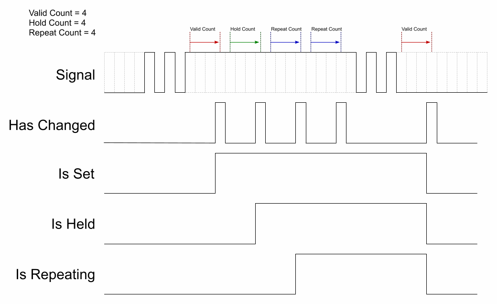


  Header: `debounce.h`  
  Supported: `TBC`  


A class to debounce signals.

It can detect signal hold, and generate auto repeat.

```cpp
etl::debounce<uint16_t Valid_Count  = 0, 
              uint16_t Hold_Count   = 0, 
              uint16_t Repeat_Count = 0>
```              

There are four variants of the class which are selected at compile time according to the supplied template parameters.
All of the template parameters are optional. 

If the first parameter is supplied then the debouncer acts as a simple signal debounce.  
The signal will become valid after `VALID_COUNT` identical samples have been added.  

If the second parameter is supplied then the debouncer will detect the signal being held true for `HOLD_COUNT` samples after becoming valid.  

If the third parameter is supplied then the debouncer will indicate that a change has occurred for the signal being held true for each `REPEAT_COUNT` that occurs after entering the hold state.  

If no template parameters are supplied then the template variant using internal variables is used.  
This has similar parameters supplied to the constructor or the `set` member function.  

The diagram below shows the effect of the various parameters.



## Functions

```cpp
debounce(bool initial_state = false)
```
**Description**  
Default constructor.  

`etl::debounce<Valid_Count, Hold_Count, Repeat_Count>`

The initial state defaults to:  

Initial state = `false`  
Valid count   = `Valid_Count`  
Hold count    = `Hold_Count`  
Repeat count  = `Repeat_Count`  

---

`etl::debounce<Valid_Count, Hold_Count>`

The initial state defaults to:  

Initial state = `false`  
Valid count   = `Valid_Count`  
Hold count    = `Hold_Count`  
Repeat count  = `0` (Disabled)  

---

`etl::debounce<Valid_Count>`

The initial state defaults to:  

Initial state = `false`  
Valid count   = `Valid_Count`  
Hold count    = `0` (Disabled)  
Repeat count  = `0` (Disabled)  

---

`etl::debounce<>`

The initial state defaults to:  

Initial state = `false`  
Valid count   = `1`  
Hold count    = `0` (Disabled)  
Repeat count  = `0` (Disabled)  

---

```cpp
debounce(bool     initial_state,
         uint16_t valid_count  = 1, 
         uint16_t hold_count   = 0, 
         uint16_t repeat_count = 0)
```
**Description**  
The constructor available when no template parameters are supplied.

Valid count   = `1`  
Hold count    = `0` (Disabled)   
Repeat count  = `0` (Disabled)  

---

```cpp
bool add(bool sample)
```
**Description**  
Adds a new signal sample. Returns true if the state of the debouncer becomes valid, held or repeating.

```cpp
bool has_changed() const
```
**Description**  
Returns `true` if the state of the debouncer became valid, held or repeating after the last sample

---

```cpp
bool is_set() const
```
**Description**  
Returns `true` if the debouncer is set, `false` if cleared.

---

```cpp
bool is_held() const
```
**Description**  
Returns `true` if the debouncer signal is being held.

---

```cpp
bool is_repeating() const
```
**Description**  
Returns `true` if the debouncer signal is repeating.

---

```cpp
void set(uint16_t valid_count, uint16_t hold_count = 0, uint16_t repeat_count = 0)
```
**Description**  
Sets the debouncer parameters.  
Only available when no template parameters are supplied.

## Examples
```cpp
etl::debounce<20> debouncer;
```
**Description**  
Simple debounce.  
Valid after 20 identical samples.

---

```cpp
etl::debounce<20, 1000> debouncer;
```
**Description**  
Key debounce.  
Valid after 20 identical samples.  
Hold detection after 1000 'set' samples.

---

```cpp
etl::debounce<20, 1000, 100> debouncer;
```
**Description**  
Key debounce with hold and auto repeat. 
Valid after 20 identical samples.  
Hold detection after 1000 'set' samples.  
Repeat every 100 samples after hold.  

---

```cpp
etl::debounce<> debouncer;
debouncer.set(20, 1000, 100);
```
**Description**  
Key debounce with hold and auto repeat.  
Runtime parameters.

---

The example below targets the Arduino hardware.

```cpp
//***********************************************************************************
// A debounce demo that reads a key and toggles the LED.
// Set the pin to the correct one for your key.
//***********************************************************************************

#include <debounce.h>

// The sample time in ms.
const int Sample_Time = 1;    

// The number of samples that must agree before a key state change is recognised.
// 50 = 50ms for 1ms sample time.
const int Debounce_Count = 50;

// The number of samples that must agree before a key held state is recognised.
// 1000 = 1s for 1ms sample time.
const int Hold_Count = 1000;   

// The number of samples that must agree before a key repeat state is recognised.
// 200 = 200ms for 1ms sample time.
const int Repeat_Count = 200;     

// The pin that the key is attached to.
const int Key = XX;

void setup()
{
  // Initialize LED pin as an output.
  pinMode(LED_BUILTIN , OUTPUT);
  digitalWrite(LED_BUILTIN, LOW);
  
  // Initialize KEY pin as an input.
  pinMode(KEY, INPUT);
}

void loop()
{
  static int led_state = LOW; 
  static etl::debounce<Debounce_Count, Hold_Count, Repeat_Count> key_state;

  // Assumes 'HIGH' is 'pressed' and 'LOW' is 'released'.
  if (key_state.add(digitalRead(KEY) == HIGH))   
  {
    if (key_state.is_set())
    {
      // Toggle the LED state on every validated press or repeat.
      led_state = (led_state == LOW ? HIGH : LOW); 
      digitalWrite(LED_BUILTIN, led_state);
    }
  }
  
  delay(1); // Wait 1ms
}
```
