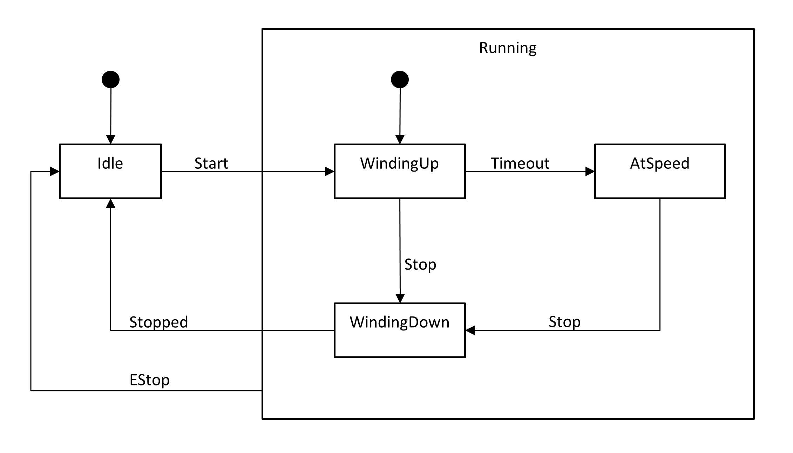


  Header: `hfsm.h`  
  Since: `20.10.0`


Hierarchical Finite State Machine  

The ETL's `etl::hfsm` is derived from etl::fsm and utilises the same state template classes.  
See `etl::fsm`  

Note:  
For an `etl::hfsm`, `on_enter_state()` cannot force a state change. It must return `etl::ifsm_state::No_State_Change`.  
If it does not, then an `ETL_ASSERT` will be raised.  

Defines `etl::hfsm` plus all defined in `fsm.h`.

## hfsm
The state machine.  
Inherits from `etl::fsm`.

```cpp
hfsm(etl::message_router_id_t id)
```
Constructor.  
Sets the router id for the HFSM.  
The HFSM is not started.

```cpp
void receive(const etl::imessage& message)
```
Top level message handler for the HFSM.

## Errors
Additional errors to `etl::fsm`.

```cpp
fsm_state_composite_state_change_forbidden
```
Inherits from `etl::fsm_exception`

**Example**  



**The states**  
```cpp
Idle        idle;
Running     running;
WindingUp   windingUp;
WindingDown windingDown;
AtSpeed     atSpeed;

struct StateId
{
  enum
  {
    Idle,
    Running,
    Winding_Up,
    Winding_Down,
    At_Speed,
    Number_Of_States
  };
}

struct EventId
{
  enum
  {
    Start,
    Stop,
    EStop,
    Stopped,
    Set_Speed,
    Timeout
  };
};

// These are all of the states for this HSFM.
etl::ifsm_state* stateList[StateId::Number_Of_States] =
{
  &idle, &running, &windingUp, &windingDown, &atSpeed
};

// These states are child states of 'Running'.
etl::ifsm_state* childStates[] =
{
  &windingUp, &atSpeed, &windingDown
};

MotorControl motorControl;

running.set_child_states(childStates, etl::size(childStates));

motorControl.Initialise(stateList, etl::size(stateList));
```
